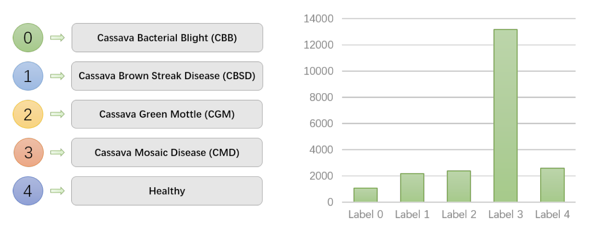
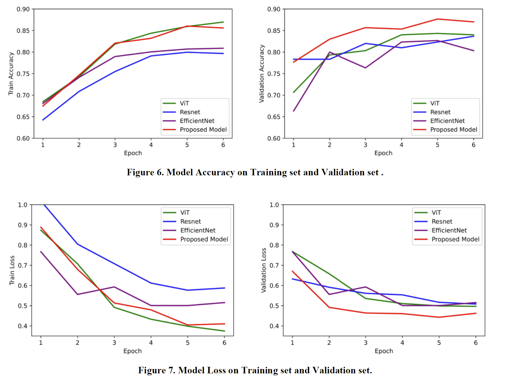

# Cassava-Leaf-Disease-Detect-Framework
Cassava Leaf Disease Detection based on CV models

Cassava is an important food security crop in Africa because it can withstand harsh environments. However, viral diseases are the main reason for crop failure. Based on photos of cassava provided by local farmers in Africa, it is possible to use deep learning technology to identify some common viral diseases so that they can be treated. This project introduced an image classification algorithm based on an ensemble learning model, which combined Vision Transformer and EfficientNet. The practice has proved that the model proposed in this project has a certain improvement in performance compared with traditional image classification methods and can effectively help local farmers.

---
## 📊Label Distribution

Dataset will be upload soon.

---
## 📈Performance

---

## ✉Contact Us

Feel free to open an issue if you have any questions about our project.
